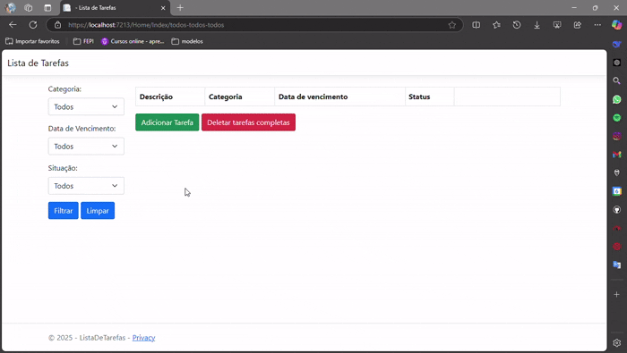

# Lista de Tarefas

## Descrição

Este é um projeto de Lista de Tarefas desenvolvido com Blazor e .NET 8. O objetivo do projeto é permitir que os usuários gerenciem suas tarefas, categorizando-as e definindo status e datas de vencimento.

## Estrutura do Projeto

O projeto está organizado da seguinte forma:

- **Controllers**: Contém os controladores MVC que gerenciam as requisições HTTP.
- **Data**: Contém a configuração do contexto do banco de dados e as classes de modelo.
- **Models**: Contém as classes de modelo que representam os dados da aplicação.
- **Views**: Contém as views Razor que definem a interface do usuário.

## Funcionalidades

- **Adicionar Tarefa**: Permite adicionar uma nova tarefa com descrição, categoria, data de vencimento e status.
- **Filtrar Tarefas**: Permite filtrar as tarefas por categoria, status e data de vencimento.
- **Marcar Tarefa como Completa**: Permite marcar uma tarefa como completa.

## Requisitos

- .NET 8 SDK
- Visual Studio 2022

## Configuração do Banco de Dados

O projeto utiliza Entity Framework Core para gerenciar o banco de dados. Certifique-se de configurar a string de conexão no arquivo `appsettings.json`.

## Executando o Projeto

1. Clone o repositório:

`git clone https://github.com/seu-usuario/microprojeto-aspnet-ListaDeTarefas.git`

2. Navegue até o diretório do projeto:

`cd seu-repositorio`

3. Restaure as dependências do projeto:

`dotnet restore`

4. Atualize o banco de dados:

`dotnet ef database update`

5. Execute o projeto:
  
`dotnet run`

### Estrutura de Arquivos

ListaDeTarefas/ 
	├── Controllers/  
		└── HomeController.cs 
	├── Data/    
	    └── AppDbContext.cs 
	├── Models/    
		├── Categoria.cs    
		├── Status.cs       
		└── Tarefa.cs    
	├── Views/   
		├── Home/                  
		├── Adicionar.cshtml   
		│   └── Index.cshtml    
		└── Shared/                 
			└── _Layout.cshtml 
		├── wwwroot/  
			└── css/      
				└── site.css 
		├── appsettings.json 
		├── Program.cs 
		└── README.md

## Créditos

Este projeto foi inspirado pelo tutorial de Crislaine D´Paula disponível no canal do YouTube. Agradecimentos especiais a Crislaine por compartilhar seu conhecimento e ajudar a comunidade de desenvolvedores.
   
   